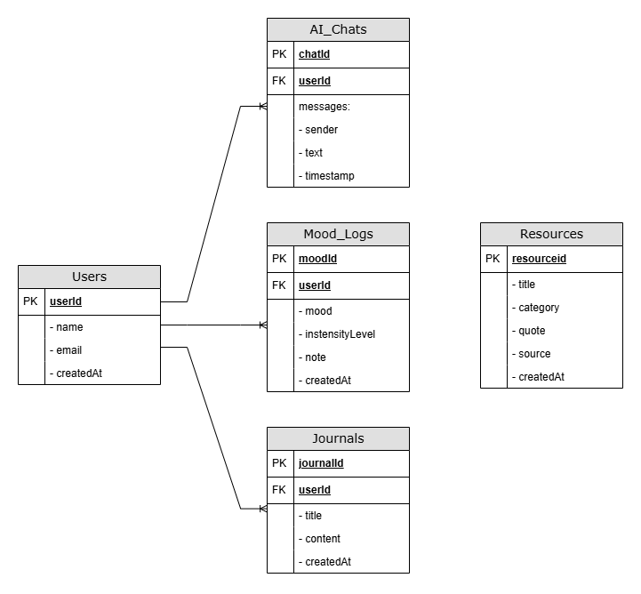

# Qalby2Heart — Islamic Counseling App

## a) Group Members
- NUR JANNAH NAI'MAH BINTI ZAINAL (2211400)
- ADLYN SOFEA BINTI MOHD ARIFF ADIKA (2214042)
- IRDINA BINTI MOHD AZMAN (2112432)

## b) Project Title
Qalby2Heart: Islamic Counseling Mobile Application

## c) Introduction
Many people experience emotional stress, anxiety, and personal challenges, but existing counseling apps often overlook spiritual and cultural needs. Muslim users, in particular, may find it difficult to access guidance that aligns with their faith while being convenient and accessible. This creates a gap for those who want counseling that supports both emotional and spiritual well-being.

To address this need, we propose **Qalby2Heart**, an Islamic counseling mobile application that will provide a safe, Shariah-compliant, and culturally sensitive platform. The app will include a _Home_ page for easy navigation, _AI Chat_ for instant guidance, _Mood Tracker_ to monitor emotions, _Resources_ for educational and spiritual content, and a _Journal_ for personal reflection. By integrating Islamic principles such as **ihsan (excellence)** and **sakinah (tranquility)**, Qalby2Heart aims to offer a meaningful alternative to conventional counseling apps, helping users manage emotional challenges while staying connected to their faith (Ismail et al., 2019).

## d) Objectives

## e) Target Users
The app targets Muslims of all ages who seek faith-based mental wellness support in a private and accessible way. This includes students, working adults, and individuals experiencing stress, anxiety, emotional distress, or those simply seeking spiritual growth, self-reflection, and emotional balance guided by Islamic values.

## f) Features and Functionalities
The app includes an AI-powered faith-based counseling chatbot, mood tracking with Islamic reflections, prayer and dhikr reminders, an organized Islamic resources library (Quranic verses and Hadith by theme), and a private digital journal. Core interactions involve chatting with the AI counselor, logging moods, receiving personalized reminders, browsing saved resources, and writing reflections. The UI features a calming dashboard, chatbot interface, mood tracker charts, resource cards, reminder notifications, and secure journal entries, all supported by Firebase for data persistence and personalization.

## g) Proposed UI Mock-up
 Architecture / Technical Design

## i) Data Model

## j) Flowchart / Sequence Diagram

## k) References
1. Ismail, N., Hassan, S. A., & Amin, A. S. (2019). Islamic counseling: An approach to mental health and emotional well-being. IIUM Journal of Educational Studies. https://journals.iium.edu.my/ijes/index.php/iejs/article/view/399/163
